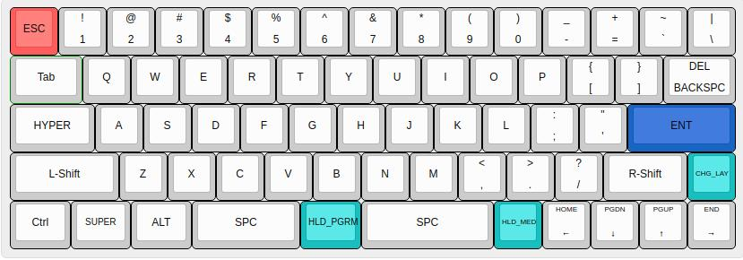
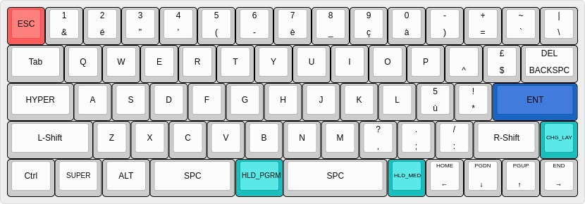
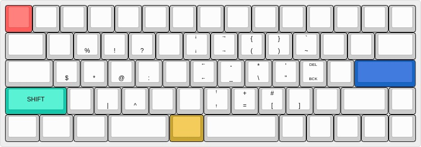
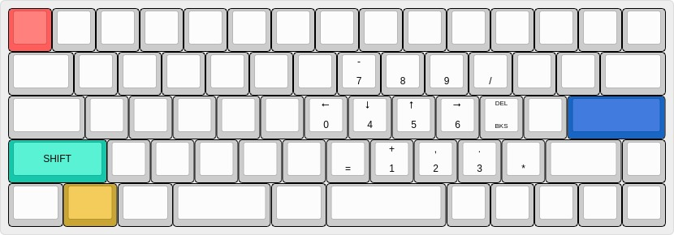
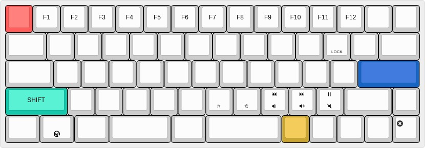
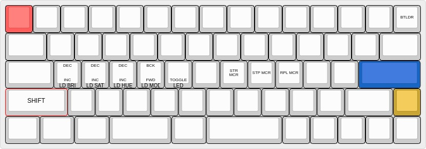

# Layers

## Base



## AZERTY (tap on `CHG_LAY`)



## Programmer (hold `HLD_PGRM`)


## Colemak Programmer (while in Colemak mode, hold `HLD_PGRM`)



## Keypad (hold `HLD_KPD`)



## Media (hold `HLD_MED`)



## Other (hold `CHG_LAY`)


 

# Instructions

## Generating keymap.c and flashing the keyboard

- Clone the repo and run `make`. Make sure python3 is installed.
- When prompted, put the keyboard into bootloader mode. There are several
  ways of doing this:
  - A button has been mapped to trigger the bootloader mode (on this config,
    it's `CHG_LAY+top_right_key`; see the `BTLDR` button on [this
    layout](static/media/other.jpg)).  
  - Unplug the keyboard, press and hold `CTLR+B` and plug it back in.
  - If none of the above methods work, you need to short the RESET pin on the
    ATmega chip. See [Resources](#resources). Use a clipper or a staple to
    connect pin 13 and 43.
- Congrats! That should be it.

## How to update layers.json

- Use [Keyboard Layout Editor](http://www.keyboard-layout-editor.com/) to
  mimic the keyboard configuration. Note: this website doesn't seem to support
  quteBrowser.
- Insert a character at the bottom of the key for a normal tap and at the top
  for a Shift+tap.
- When finished,
    1. Copy the permalink and add it to `static/layers.json` under a
       `"URL"` key.
    2. Download the layout as a JSON and copy/paste it in
       `static/layers.json` under the `layout` key.

### Tips

When hacking around, we can get a lot of `keyboard-layout.json` files
laying around in the Downloads folder (I'm currently at 33 and counting). A
quick way to parse the content of the latest downloaded file is to use this
command:

```bash
xclip -selection clipboard ~/Downloads/keyboard-layout\ $(ls -lastr ~/Downloads | tail -n 3 | awk '/keyboard/ { print $11 }')
```

This assumes that each `keyboard-layout` file has the following structure:
`keyboard-layout (33).json` (and 33 is dynamic).

## How to update the list of supported keys

- Make your way around the ugly `app/keycode_mapper.py`.

# Specificities

## Shift as a dedicated layer

In this implementation, Shift is not used in a standard manner. Instead of
sending a "SHIFT" message, it changes layer entirely.  
On the one hand, this
allows to define completely new keys. For instance, we can define a key
where `{` is the behaviour in lowercase, and `(` is the behaviour in upper
case. Try finding that key on a normal keyboard,... it doesn't exist!  
But on the other hand, it can also cause unexpected behaviours like:

- In software like Gimp or Google Presentations, holding Shift and clicking on
  multiple objects to select them all won't work. It's as is `Shift` is not
  pressed.
- If used in combination with other layers (like the PGRM layer), the keyboard can sometimes get stuck in "Shift" layer. Hitting Ctrl+w to close 1 tab in your browser will actually close the entire browser, as if Ctrl+Shift+w had been pressed.

These two things alone are fairly cumbersome so I might drop the idea of "Shift
as a layer" in the future.

## [WIP] "Magic key" to change between layouts

- how it works (held --> uses the "other" layer, tapped --> switch to colemak)
- how it's implemented: process_record_user. see the [QMK
  documentation](https://github.com/qmk/qmk_firmware/blob/master/docs/custom_quantum_functions.md#custom-keycodes)

# Backlog

- Azerty on the magic key?

# Resources

- [Technical sheet of the ATmega32U4
  chip](http://ww1.microchip.com/downloads/en/devicedoc/atmel-7766-8-bit-avr-atmega16u4-32u4_datasheet.pdf),
  see page 3. The reset pin is at location 13 and a convenient GND pin is at
  location 43.

# Dependencies (Linux)

- Sending Unicode characters requires [IBus](https://wiki.archlinux.org/index.php/IBus#Installation) to be running on your system. Make sure it is running all the time!
- One dependency I was lacking was [PyGObject](https://pygobject.readthedocs.io/en/latest/getting_started.html) (`pip install PyGObject --user`)
- QMK requires the installation for `pycairo`, for this, ensure that:
  - You have installed [pkg-config](https://stackoverflow.com/a/36440831).
  - You have installed [cairo](https://www.cairographics.org/download/).
